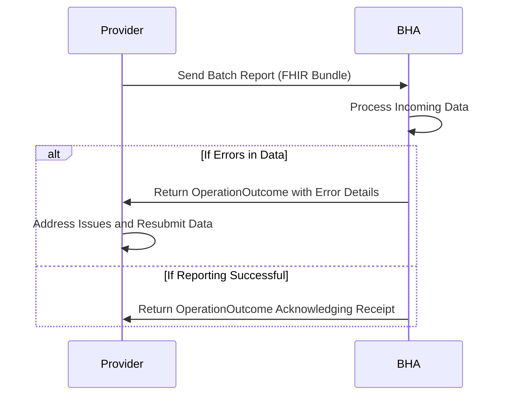

The covered providers engage with covered patients for covered services such as Substance Use Disorder (SUD) treatment and mental health treatment. There are a variety of events during these engagements that are important to capture and report to BHA, such as client admissions, discharges, and updates to client information. This section describes the key events in the workflow of behavioral health data exchange and the associated reporting requirements to BHA.

The engagements with the patients are often long term engagements that span multiple months or years, and there may be multiple events that occur during the course of the engagement. For example, a client may be admitted to a provider for SUD treatment, then later discharged, and then readmitted at a later date. Each of these events would need to be captured and reported to BHA according to the specifications in this IG. For any given client, and any given type of treatment, there may be multiple admissions, discharges, and updates that occur over time, and all of these events would need to be captured and reported to BHA to ensure accurate and comprehensive data collection.

At the top level, the overall engagement of a client/patient with a covered provider will be considered an EpisodeOfCare. Within that EpisodeOfCare, there may be multiple kinds of "programs" that would recorded as a "program" type EpisodeOfCare, such as a SUD treatment program or a mental health treatment program. Within each of those "program" type EpisodeOfCare, there may be multiple "admission" events that would be recorded as an Encounter resource, and multiple "discharge" events that would also be recorded as Encounter resources. There may also be updates to client information that would be recorded as updates to the relevant FHIR resources (e.g., updates to the Patient resource for demographic information, updates to the Condition resource for diagnosis information, etc.).

#### Illustrative Example of Workflow and Reporting Milestones

- A client begins an overall EpisodeOfCare with a covered provider.
  - Client
  - Client QuestionnaireResponse
  - EpisodeOfCare resource (overall)
- At the same starting point, the client starts a SUD treatment program (program EpisodeOfCare), with an initial SUD encounter and admission reporting milestone.
  - EpisodeOfCare resource (SUD program)
  - Encounter resource (SUD admission)
  - Episode Diagnosis Condition resource (SUD diagnosis)
  - Admission QuestionnaireResponse
  - Diagnosis QuestionnaireResponse
  - Substance Use Disorder QuestionnaireResponse (SUD diagnosis)
- During the overall EpisodeOfCare, a mental health treatment program (program EpisodeOfCare) is started
  - EpisodeOfCare resource (MH program)
  - Admission QuestionnaireResponse
  - Encounter resource (MH admission)
  - Diagnosis QuestionnaireResponse
  - Episode Diagnosis Condition resource (MH diagnosis)
- The SUD program continues over time and later reaches a final SUD encounter and discharge reporting milestone.
  - Discharge QuestionnaireResponse
  - Encounter resource (SUD discharge)
  - EpisodeOfCare resource (SUD program discharge)
  - Episode Diagnosis Condition resource (SUD diagnosis update)
  - Substance Use Disorder QuestionnaireResponse (SUD diagnosis update)
- Starts a Pregnancy program, the first encounter is a Pregnancy Followup event and the later encounter is a Pregnancy Birth event.
  - EpisodeOfCare resource (Pregnancy program)
  - Encounter resource (Pregnancy Followup)
  - Admission QuestionnaireResponse
  - Diagnosis QuestionnaireResponse
  - Pregnancy Status QuestionnaireResponse
- The mental health program has its own first and last encounters (MH start and MH end), each with corresponding admission and discharge reporting milestones.
  - Encounter resource (MH discharge)
  - Discharge QuestionnaireResponse
  - Encounter resource (MH admission)
  - Admission QuestionnaireResponse
- Pregnancy program has a Birth event encounter with corresponding reporting milestones.
  - Encounter resource (Pregnancy Birth)
  - Admission QuestionnaireResponse
  - Birth QuestionnaireResponse
  - Client QuestionnaireResponse (for baby)
  - Client (baby) resource
  - Discharge QuestionnaireResponse (for pregnancy program)
  - Pregnancy Status QuestionnaireResponse (update to pregnancy status)
- All program activity remains within the same overall EpisodeOfCare window, which closes after the latest program activity is complete.
  - Discharge from the overall EpisodeOfCare after all program activity is complete.
  - Encounter resource (overall discharge)
  - Discharge QuestionnaireResponse (overall discharge)
  - EpisodeOfCare resource (overall discharge)

Note: The above illustrative does not include updates. Such as if details in the Client (Patient) demographics change, or diagnosis details are updated. These updates would be captured as updates to the relevant FHIR resources (e.g., Patient resource, Condition resource, etc.) and would also be reported to BHA according to the specifications in this IG.

### Reporting to BHA

The covered providers may report to BHA directly or through intermediaries such as Behavioral Health Administrative Service Organizations (BHASOs). The reporting may occur in real-time or in batches, depending on the provider's capabilities and the requirements set by BHA. The following focuses on the reporting of key events such as admissions, discharges, and updates to client information directly to BHA.

- **Admissions**: When a client is admitted to a covered provider for SUD treatment or mental health treatment, an Encounter resource would be created to capture the details of the admission event. This Encounter resource would include information such as the date and time of admission, the type of treatment program (e.g., SUD treatment program, mental health treatment program), and any relevant clinical information (e.g., diagnosis codes, procedures performed, etc.). This Encounter resource would then be reported to BHA according to the specifications in this IG.
- **Discharges**: When a client is discharged from a covered provider, another Encounter resource would be created to capture the details of the discharge event. This Encounter resource would include information such as the date and time of discharge, the reason for discharge (e.g., completed treatment, left against medical advice, etc.), and any relevant clinical information (e.g., diagnosis codes, procedures performed, etc.). This Encounter resource would also be reported to BHA according to the specifications in this IG.
- **Updates to Client Information**: If there are updates to client information (e.g., changes in demographic information, updates to diagnosis information, etc.), these updates would be captured as updates to the relevant FHIR resources (e.g., Patient resource, Condition resource, etc.). These updated resources would then be reported to BHA according to the specifications in this IG.
- **Pregnancy Status**: If there are updates to a client's pregnancy status, these updates would be captured as updates to the relevant FHIR resources (e.g., Patient resource, Condition resource, etc.). These updated resources would then be reported to BHA according to the specifications in this IG.
- **Births**: If there are updates related to a client's birth events, these updates would be captured as updates to the relevant FHIR resources (e.g., Patient resource, Condition resource, etc.). These updated resources would then be reported to BHA according to the specifications in this IG.

The above diagram shows when the key reporting milestones would occur for the different types of events (admissions, discharges, updates to client information, pregnancy status updates, birth updates) in relation to the overall EpisodeOfCare and the program-specific EpisodeOfCare timelines. The specific timing and frequency of reporting to BHA may vary based on the provider's capabilities and the requirements set by BHA, but the diagram illustrates the general workflow and key events that would be captured and reported according to this IG.

These may be reported as they happen, individual reporting events per patient per milestone. However they covered providers may choose to report in batches. Taking all of the events that occur for a given patient within a given time period (e.g., a day, a week, etc.) and reporting them together in a batch to BHA. The specific timing and frequency of reporting to BHA may vary based on the provider's capabilities and the requirements set by BHA, but the key events that would be captured and reported according to this IG would remain consistent regardless of whether the reporting is done in real-time or in batches. This would be done using a FHIR Bundle transaction with all of the relevant resources (e.g., Patient, Encounter, Condition, and QuestionnaireResponse resources). 

BHA would process the incoming data and generate OperationOutcome responses to indicate the success or failure of the reporting. If there are any errors in the reported data (e.g., missing required fields, invalid values, etc.), BHA would include details about the errors in the OperationOutcome response so that the covered providers can address the issues and resubmit the data as needed. If the reporting is successful, BHA would acknowledge receipt of the data and may provide additional information or feedback as appropriate based on the content of the reported data.

Sequence Diagram of a Batch Reporting Workflow:

Given the Illustrative Example above. If the whole overall EpisodeOfCare took place in the span of time that falls within a single reporting period (e.g., a week), then the covered provider may choose to report all of the events that occurred during that EpisodeOfCare together in a single batch report to BHA at the end of the reporting period. This batch report would include all of the relevant resources (e.g., Patient, Encounter, Condition, and QuestionnaireResponse resources) for all of the events that occurred during that EpisodeOfCare. BHA would then process the batch report and generate an OperationOutcome response as described above. If there are any errors in the reported data, BHA would include details about the errors in the OperationOutcome response so that the covered providers can address the issues and resubmit the data as needed. If the reporting is successful, BHA would acknowledge receipt of the data and may provide additional information or feedback as appropriate based on the content of the reported data.

