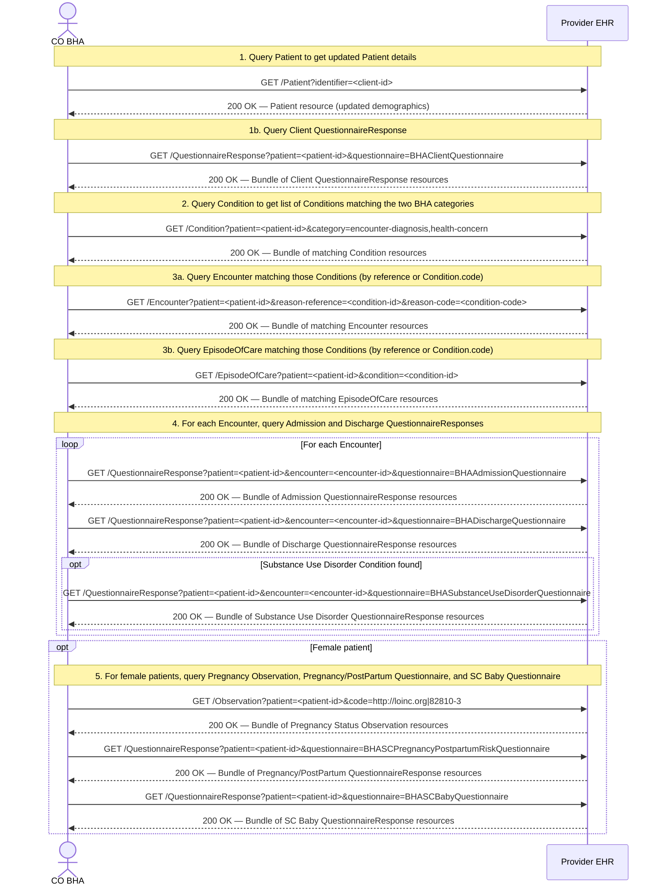

The following is a generalized workflow for how CO BHA will request the needed data from the providers using the Profiles and Questionnaires defined in this IG. This workflow starts with the premice that CO BHA knows the list of Clients that are in the program, and has the necessary information to identify those clients in the provider's EHR system.  This workflow also assumes that the provider has implemented the necessary FHIR endpoints to receive requests from CO BHA, and to return the necessary data to CO BHA.

